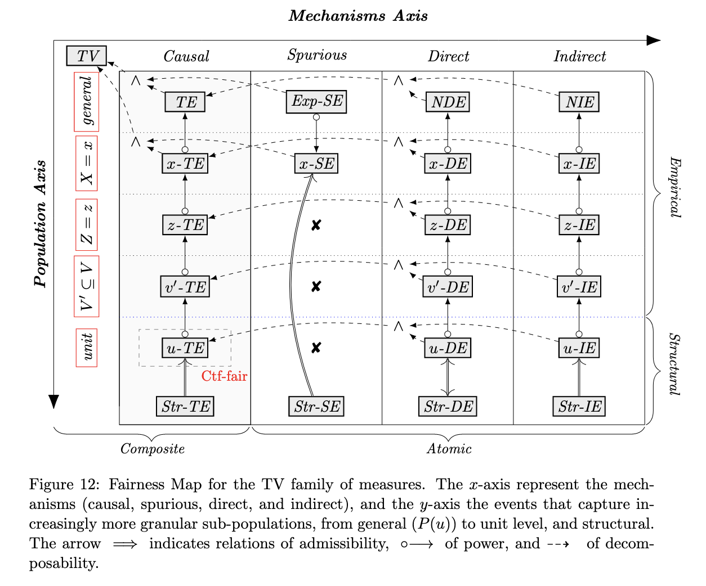
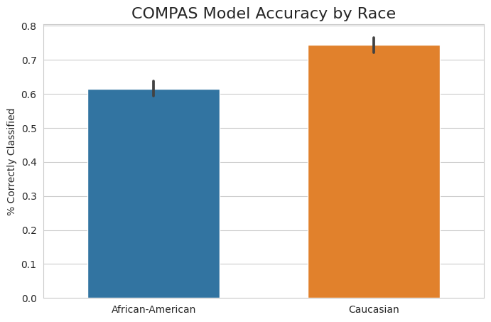
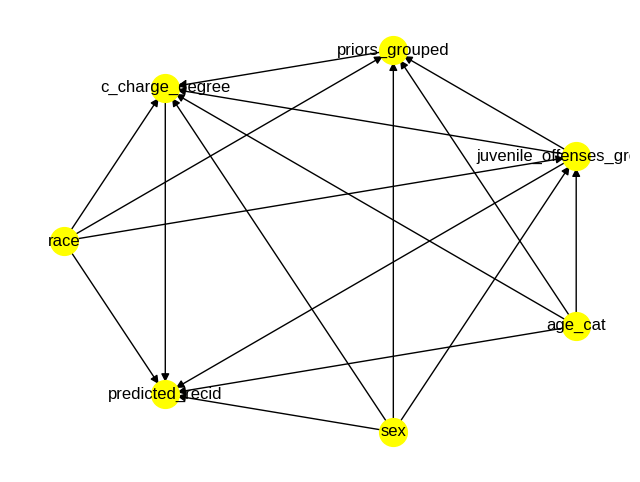
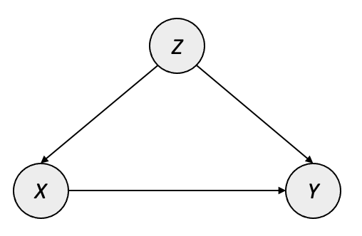

# Model Fairness {#model-fairness}

The ethical implications of widespread ML adoption in practice could easily fill this entire book. Models have an increasingly significant impact on human lives --- from the content a user sees on social media to credit approval and health outcomes. As such, it is paramount that practitioners approach model creation and deployment in an intentionally ethical manner. 

With this in mind, much has already been written about ML ethics more broadly; for the sake of maintaining a focus on practical causal techniques, we will not rehash the high-level concepts around ethical concerns of machine learning applications in full. We will instead assume the reader has some familiarity with these ethical issues, introduce necessary definitions, and focus on how causality can be used to measure and mitigate algorithmic bias in practice.

Specifically, this section covers causal techniques that aid in the assessment of model fairness as well as the creation of fair models. We will discuss the need for causal methods instead of standard statistical tools when evaluating potentially discriminatory effects.

## Introduction to Model Fairness

### Prerequisite Knowledge
In this chapter, we will assume that the reader has a general understanding of issues surrounding algorithmic bias. If this is not the case for you, we recommend Chapter 3 of the `fast.ai` book ^[This chapter, along with the rest of the fast.ai book, is also available in Jupyter Notebook format on their [GitHub](https://github.com/fastai/fastbook/blob/master/03_ethics.ipynb).] [@howard2020deep] as a starting point. 

For a deeper view, [@mehrabi2019bias] provides a thorough survey of these topics from the machine learning perspective, including helpful distinctions between the types of bias which stem from datasets, the algorithms themselves, deployment techniques, and environmental or social factors (and how these concepts differ from the purely statistical notion of *bias*). We will rely on these definitions throughout this chapter, as described in the next section.

We also assume familiarity with causal inference techniques which can be gained in earlier chapters of this book; specifically, the causal estimation process outlined in Chapter \@ref(causalestimation).

### What is Model Fairness?

The term *algorithmic bias* has become somewhat of an umbrella term for general concepts around unethical applications of technology: for example, a recent blog post by Liberties EU [@liberties_eu_2021] provides a definition of algorithmic bias that ranges from the infamous COMPAS recidivism algorithm to airbag systems being better adapted for male bodies than female bodies. Such a definition helps draw attention to disparities, but it is not precise enough to distinguish issues which are specifically relevant to machine learning

In this chapter, we use *model fairness* to focus on the concepts of algorithmic bias directly related to the development, training, and deployment of machine learning models: specifically that a ML model or system may produce outputs which perpetuate, reinforce, or amplify discriminatory behavior; and that the model's quality can vary across groups. The definitions in section 4 of [@mehrabi2019bias] provide a nuanced view of the aspects of fairness in machine learning, including the categorization of fairness at the individual (similar individuals should receive similar outcomes) and group (different groups should be treated equally) levels. 


## How is Fairness Measured?

Both [@mehrabi2019bias] and [@caton2020fairness] categorize the wide variety of existing fairness quantification methods. Each method provides a slightly different approach to the quantification of model fairness, and each comes with its own assumptions about the user's responsibility for assessing fairness: as an extreme example, one approach named "Fairness Through Unawareness" -- described in [@kusner2017counterfactual] -- asserts that a model is fair as long as it does not explicitly use protected attributes as features. Most techniques, however, recognize that reasonably complex models have the ability to proxy protected attributes through more subtle interactions. Examples of such definitions are "Demographic Parity" and "Equality of Opportunity," which are also defined in [@kusner2017counterfactual].

Many of these methods focus on the joint distribution of model errors with protected categories (and, in some cases, other relevant covariates). One example is *conditional statistical parity*, originally [@corbett2017algorithmic], which states that, "For a set of legitimate factors $L$, predictor $\hat{Y}$ satisfies conditional statistical parity if $P(\hat{Y} |L=1,A = 0) = P(\hat{Y}|L=1,A = 1)$" [@mehrabi2019bias]. Essentially, conditional statistical parity attempts to measure whether individuals in different groups have similar outcomes (e.g. likelihood of being correctly classified) when controlling for relevant covariates.

In addition to these aggregate methods, some fairness measures focus on the similarity of predictions among similar individuals, while others measure the quality of the model's calibration among individuals in differing groups. 

Unfortunately, practical adoption of fairness measurements is not yet widespread at this time, and metric selection is inconsistent from one use case to the next. In other words, relatively few practitioners are using fairness methods at all, and when they do, they use different techniques with different assumptions. Before we dive into the current state of causal fairness metrics, we will take a moment to discuss why practitioners and researchers should choose causal methods over other techniques.


## Why Use Causality?

With such a wide variety of available fairness evaluation methods, one could reasonably question whether causality should be preferred over "standard" non-causal techniques. 

First, the statistical notion of omitted variable bias means that algorithmic fairness/bias estimates may be flawed if the user does not control for the necessary covariates. Simpson's Paradox describes reversals in estimated effects when changing the conditioning variables [@sep-paradox-simpson], and such reversals can be disastrous when assessing possible discriminatory treatment by ML systems. For example, if one wishes to use conditional statistical parity to evaluate discriminatory behavior, the definition of "legitimate factors" may be up for debate, and the decision to include or exclude certain factors can significantly impact results. The practice of creating a graphical model for causal inference enumerates all assumptions about how the world works with respect to the analysis at hand [@pearl2016causal]. The causal graph creates a reference point for the foundational assumptions that underlie a fairness analysis, and it can be debated and refined as needed by subject matter experts. 

The other major benefit of framing model fairness questions as causal inference tasks is that we gain understanding for the actual mechanisms of bias. A correlational approach can describe whether an observed discrepancy exists, but cannot tell you why it exists or the degree to which such a discrepancy is actually causal in nature. This makes the use of causal language extremely important when describing unethical treatment: it allows us to articulate the mechanisms through which an algorithm might propagate biased outcomes.

To summarize, the answer to the question of *"why should I use causality?"* is ultimately the same for applications in model fairness as it is for any other use of causal inference: 

1. The creation of a causal graph formalizes assumptions about how the world works (in this case, how bias might be perpetuated by a machine learning model or system)
1. Framing fairness analysis as a causal inference task allows us to understand and directly quantify mechanisms of bias instead of simply recognizing that a discrepancy exists


## Causal Fairness Measures

### Background 
The first concerted efforts to estimate model fairness with causal methods involved framing the fairness problem in the same way as any other causal inference task and using existing metrics. [@kusner2017counterfactual] suggests using Effect of Treatment on the Treated (ETT) [@pearl2009overview] to measure causal effect. However, ETT does not distinguish the effect that is caused specifically by the treatment as opposed to backdoor channels, so later work -- as described in [@10.5555/3504035.3504283] -- used specific measures to highlight the mechanisms of discriminatory effect. This work used three causal measures to account for this distinction:

* Controlled direct effect (CDE) describes the effect of the treatment $X$ on the outcome $Y$ while holding everything else constant (hence the *controlled* aspect). As the name suggests, this "direct" measure intends to quantify the disparity that is due explicitly to $X$ which, in the fairness setting, would be a protected category such as gender, race, or religion. 
* Natural direct effect (NDE) is slightly different from CDE in that it describes the direct effect of $X\rightarrow Y$ when any mediators $W$ in $X\rightarrow W \rightarrow Y$ are set to the values they would naturally obtain when intervening on $X$
* Natural indirect effect (NIE) measures the change in the outcome $Y$ that is due to shifts in the mediators $W$ while the treatment $X$ remains constant. 

These three metrics can be used to describe the amount and the nature of unfair treatment in many fairness settings. However, the underlying assumptions only hold when $X$ does not have another parent node in the causal graph; if this is not the case, other sources of discrimination may exist which would not be captured by CDE, NDE, and NIE.

### The Standard Fairness Model
It is often the case that researchers interested in studying potentially discriminatory behavior of a model may not have access to the inner workings of the model (e.g. proprietary data or system dynamics), which poses challenges for robust causal inference using standard tools. In [@10.5555/3504035.3504283], the authors introduce the _Standard Fairness Model_, a causal model to be used generally for questions concerning ML model fairness -- including when information about the model's decision-making process is limited. 

The causal graph for the Standard Fairness Model is given here, where $X$ is the protected category, $Y$ is the outcome, $W$ is a possible set of mediators between $X$ and $Y$, and $Z$ is a possible set of confounders between $X$ and $Y$.


```{r sfm generic, out.width="50%", echo=FALSE, fig.align='center'}
knitr::include_graphics('img/SFMGeneric.png')
```

Along with this causal model, Zhang and Bareinboim introduce a suite of counterfactual measures that account for the specific types of discriminatory effect. These quantities are similar in nature to CDE/NDE/NIE in that they quantify both direct and indirect effect, but Zhang and Bareinboim address the limitations of CDE/NDE/NIE by introducing a dedicated measure for the spurious effect that arises when confounders are present (i.e. $X \leftarrow Z \rightarrow Y$):

* Ctf-DE: the counterfactual _direct_ effect of the treatment $X$ on the outcome $Y$. This measures how $Y$ changes when $X$ goes from $x_0\rightarrow x_1$ while mediators $W$ retain the values they would have naturally attained at $X=x_0$. This is similar in nature to NDE, but it simply tries to capture "the existence of any disparate treatment" such that when $\text{Ctf-DE}\neq0$, then there is evidence to indicate that some amount of disparity exists which is due directly to the protected category $X$
* Ctf-IE: the counterfactual _indirect_ effect of the treatment $X$ on the outcome $Y$. This is essentially a flipped version of Ctf-DE, meaning that instead of shifting $X$ from $x_0\rightarrow x_1$, the mediators $W$ shift to what they would have naturally attained at $X=x_1$ while $X$ remains at $x_0$. The counterfactual indirect effect seeks to measure discrimination through backdoor channels.
* Ctf-SE: the counterfactual _spurious_ effect measures the residual or leftover effect which is due to confounders, or common ancestors, of $X$ and $Y$. This is the missing component of the CDE/NDE/NIE framework, since it allows us to quantify differences due to spurious relationships between the protected factor and the outcome. Cases where no discrimination exists will have DE and IE equal to 0, with the entirety of the observed variation allocated to spurious effect.

The formulas for these measures are given below:

$$ 
\begin{aligned}
\text{Ctf-DE}_{x_0, x_1}(y|x) &= P(y_{x_1, W_{x_0}}|x) - P(y_{x_0}|x) \\
\text{Ctf-IE}_{x_0, x_1} (y|x) &= P(y_{x_0, W_{x_1}}|x) - P(y_{x_0}|x)\\
\text{Ctf-SE}_{x_0, x_1} (y) &= P(y_{x_0}|x_1) - P(y|x_0)
\end{aligned}
$$

If certain assumptions hold -- namely those outlined in the relations of the variables as outlined in the Standard Fairness Model -- these measures are directly estimable from observational data. The identification formulas for these metrics are given here:

$$ 
\begin{aligned}
\text{Ctf-DE}_{x_0, x_1}(y|x) &= \sum_{z, w}\big[P(y|x_1, z, w) - P(y|x_0, z, w) \big] P(w|x_0, z)P(z | x) \\
\text{Ctf-IE}_{x_0, x_1} (y|x) &= \sum_{z, w}P(y|x_0, z, w)\big[P(w|x_1, z) - P(w|x_0, z) \big]  P(z|x) \\
\text{Ctf-SE}_{x_0, x_1} (y) &= \sum_z P(y|x_0, z) \big[P(z|x_0) - P(z|x_1) \big]
\end{aligned}
$$

These identification formulas provide a way to calculate discriminatory effect using observational data, which greatly simplifies the causal estimation in cases where the Standard Fairness Model applies.

One attractive quality of this set of measures is that they provide a decomposition for the total observed disparity. In many cases, this high-level, non-causal difference in outcomes between protected groups -- $TV=P(y|x_1) - P(y|x_0)$ -- is the first indicator that something may be amiss. These counterfactual measures break the total variation down into distinct components which quantify both the amount and the nature of any discriminatory effect that exists in the dataset. The decomposition of $TV$ is provided here:

$$
TV_{x_0, x_1}(y) = DE_{x_0, x_1}(y|x_0) - SE_{x_1, x_0}(y) - IE_{x_1, x_0}(y|x_0)
$$

### A Framework for Causal Fairness Analysis {#cookbook}

In their latest work, Plečko and Bareinboim build upon the Standard Fairness Model to propose a standardized process for assessing model fairness with causality. We will provide a practical introduction to their tools, but we suggest that readers interested in going deeper with causal fairness techniques refer to their paper [@pleckobareinboim2022] and [website](https://fairness.causalai.net/) for further details as well as continued updates to the extended version of the _Fairness Cookbook_. 

Plečko and Bareinboim begin by formalizing what they call the _Fundamental Problem of Causal Fairness Analysis_, which is essentially the need to decompose the total variation in the observed outcomes into more meaningful causal measures. They provide a toolkit for approaching this problem by organizing existing causal fairness metrics (including ETT, CDE, NDE, NIE, and Ctf-DE/IE/SE) into a hierarchy ranging in granularity on the population level (from the total population to an individual unit) as well as in the mechanism of the disparity (including causal, spurious, direct, and indirect). Additionally, the Fairness Map shows how metrics relate to and build upon each other, as well as the types of quantifications that are not possible. The Fairness Map in [@pleckobareinboim2022] is provided below:



#### The Fairness Cookbook
Plečko and Bareinboim continue by introducing the _Fairness Cookbook_, which is a step-by-step process designed to be used by analysts seeking to answer questions of fairness with causal tools. A condensed version of the Fairness Cookbook is provided here, but readers are encouraged to explore the specific examples available in [@pleckobareinboim2022]:

1. Obtain the dataset
2. Determine the Standard Fairness Model projection
    * Define which variables in your dataset map to variable sets $W$ and $Z$ in addition to the treatment $X$ and outcome $Y$
    * Also assess whether bidirected edges exist between these variable groups -- if so, more work will be required to estimate causal impacts
3. Assess disparate treatment
    * Use one of the $-DE$ methods to quantify the direct effect
4. Assess disparate impact
    * Use one of the $-IE$ methods to quantify indirect effect

## Fairness Case Study: Identifying Bias in the COMPAS Recidivism Model

Our case study for evaluating model fairness uses the COMPAS dataset. COMPAS is an infamous model which was the subject of an [analysis by ProPublica](https://www.propublica.org/article/machine-bias-risk-assessments-in-criminal-sentencing) revealing its discriminatory bias against black defendants, resulting in longer sentencing than their white colleagues. The full Python code used in this case study is available in [this Colab notebook](https://colab.research.google.com/drive/1bviQfw1BWtgKw4O-XXPAqXb-t7vtMRls?usp=sharing). 

### Framing the Problem + Non-Causal Estimates

The ProPublica analysis uses traditional statistical tools to investigate the disparity in model output by the defendant's race, and they showed that the algorithm produces higher predicted likelihood of recidivism for black defendants than white defendants. Figure \@ref(fig:compas-pred) illustrates the high-level difference in the percentage of defendants predicted as "Medium" or "High" recidivism risk.

```{r compas-pred, fig.cap="Difference in COMPAS Recidivism Predictions by Race", fig.align='center', echo=FALSE, out.width='75%'}
knitr::include_graphics("img/CompasPredictionsByRace.png")
```

As we can see, there is a large difference in model output between the two groups: black defendants are predicted as Medium or High risk at a much higher rate than their white counterparts. However, it is possible that there are underlying factors contributing to this trend, such as the nature of the charge. The published analysis uses a generalized linear model to control for certain covariates when estimating the discriminatory effect of race on model predictions: specifically, the authors control for the defendant's sex, age, charge degree (felony or misdemeanor), and number of prior convictions, while interpreting the coefficient for race as the discriminatory effect. This method estimates that black defendants are 56.6% more likely to be predicted as Medium or High risk than similar white defendants. Since model output is used directly in sentencing, this would be an alarming finding.

Another way to assess model fairness is by directly modeling some relevant performance metric to determine whether the model performs suboptimally on certain groups. We can see in Figure \@ref(fig:compas-acc) that there is, again, a large difference in outcomes by race.

```{r compas-acc, fig.cap="Difference in COMPAS Model Accuracy by Race", fig.align='center', echo=FALSE, out.width='75%'}

```

A similar non-causal approach can be taken here, with the indicator of model correctness (i.e. whether the model accurately predicted a defendant as Low or Medium/High risk) serving as the dependent variable instead of the binarized model score. Controlling for the same factors, this model estimates that the model is correct 10.5% less often for black defendants than white defendants. This also would be a concerning result, indicating that the model does not perform as well when presented with data from black defendants.

### Causal Measures 

The previous section illustrates two great ways of framing the problem of model fairness, by targeting one or both of the following quantities:

1. Model predictions
2. Performance metrics (e.g. accuracy, precision, recall)

These two pieces of information represent the primary aspects of a model-driven decision process. The problem, as we have seen throughout this book, is that we cannot be sure of the causal interpretation of the estimates produced by the linear models in the previous section. The only way we can have this confidence is with causal inference, starting with the construction of a causal graph. We use the COMPAS graph described in [@pleckobareinboim2022], which is shown in Figure \@ref(fig:compas-graph) from the `DoWhy` causal model visualization:

```{r compas-graph, fig.cap="Causal Graph for COMPAS Predictions", fig.align='center', echo=FALSE, out.width='75%'}

```

After the graph is constructed, we care mostly about the edge between `race` and `predicted_recid`, which estimates the direct discriminatory effect based on the defendant's race. As you might expect, using `DoWhy` to repeat the analysis with causal estimates produces different results compared to the non-causal estimates. This table compares the estimates produced by the causal and non-causal estimates.

|Outcome|Causal Effect|Non-Causal Effect|
|:--:|:-:|:-:|
| Predicted recidivism | +21.8%| +56.6% |
| Model accuracy | -11.6% | -10.5%|

Both approaches agree that there is some degree of quantifiable racial bias in the COMPAS algorithm, but there is a difference in the amount that is due to race. We don't see a major reversal in trends like in the Simpson's Paradox examples, but taking the time to frame the analysis in terms of causal relationships gives us more confidence in quantifying true causal effects. 

## Additional Topics
### Enforcing Fairness During Model Training
In addition to assessing whether an existing model or ML system is behaving unfairly, recent work has incorporated fairness directly into the model-building process. [@distefano2020] introduces a loss penalty based upon the controlled direct effect (CDE) measuring the disparity one wishes to minimize. Here we show the causal diagram that is assumed to hold for the process which generated the data used in the ML task. The authors use $Z$ as the protected category, $Y$ as the task label (e.g. 0/1 in binary classification), and $\mathbf{X}$ as covariates in the model.


```{r mfcde dag, out.width="50%", echo=FALSE, fig.align='center'}

```

One important assumption encoded into this causal model is that no confounder exists which would open a backdoor path between the protected category $Z$ and the label $Y$. This is likely the case for many contexts of fairness --- for instance, there is no common cause between a person's race and whether the person clicks on an ad, gets into a traffic collision, or defaults on a loan --- but this assumption should be validated for each use.

The authors proceed by framing the problem of training a fair model as the process of building a model that does not learn the CDE between $Z$ and $Y$. A significant challenge with such an approach is that many popular machine learning algorithms require differentiable loss functions; the authors address this by leveraging propensity scoring from a surrogate model to minimize the CDE via mean-field approximation (MFCDE) along with the task's original loss (e.g. binary cross-entropy). This is formally defined as the combination of a regularization weight $\lambda$ with the original loss $\mathcal{L_o}$ and a differentiable fairness penalty $\mathcal{R_f}$:

$$ \mathcal{L}_f =  (1-\lambda)\mathcal{L_o} + \lambda\mathcal{R_f}$$

The fairness penalty is derived using propensity matching to calculate the MFCDE iteratively as the model updates. This happens via a surrogate model that uses the propensity scores and the protected attribute as inputs to predict the model's output at that iteration -- this connection to the model being trained provides the differentiable component required to use the fair loss as a gradient-based optimization target. 

The drawback of such an approach is that the surrogate model must be updated at each iteration, which adds computational overhead: both from surrogate model training and the need to provide updated predictions to be used as the surrogate model's training set. However, the authors show that a model trained to minimize MFCDE does show practical reduction in the CDE measuring the disparity of interest. The authors also note that, for higher values of $\lambda$, it may be beneficial to "pre-train" the classifier using smaller values of $\lambda$ before increasing incrementally to the desired level of regularization.


### Fairness in Reinforcement Learning

Measuring fair outcomes in a reinforcement learning setting could be done using the techniques outlined in the Fairness Cookbook (\@ref(cookbook)) given that the model is already trained and one simply wants to assess whether it is behaving fairly. However, since assumptions and behaviors when training RL agents differ significantly from supervised learning, additional topics on fairness in reinforcement learning will be covered in Chapter \@ref(rl).